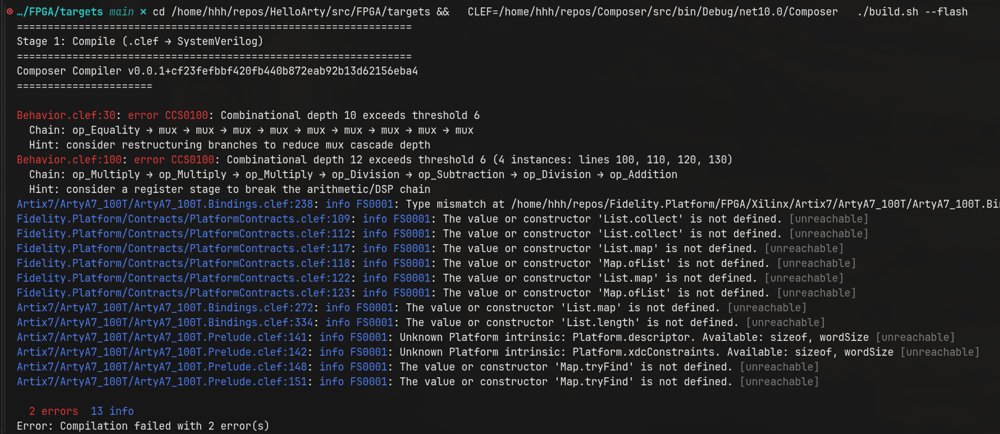

# HelloArty

HelloArty is a Clef FPGA program targeting the Digilent Arty A7-100T. Four green LEDs breathe in a sinusoidal chasing wave, with RGB LEDs following in a user-selected color.
Switches control color and master power; buttons latch the breathing cadence.

The design compiles from idiomatic Clef source through the Composer FPGA pipeline
to synthesized hardware without HDL or hardware-specific syntax. The compiler
[infers bit widths and machine classification](https://clef-lang.com/blog/fpga-and-hardware-inference/)
directly from the source, so `step` reads like an ML function while producing
area-efficient CIRCT output.

## Architecture

HelloArty is structured as two programs that share a BAREWire contract:

```
src/
├── HelloArty.fidsln            # (future) Solution tying FPGA + Monitor + Shared
├── Shared/
│   └── Contract.clef           # [<BAREWireSchema>] ArtyReport, owned by neither program
├── FPGA/
│   ├── HelloArty.fidproj       # FPGA build manifest  (output_kind = "fpga")
│   ├── Behavior.clef           # Wave chase logic (smoothstep brightness, phase offsets)
│   └── Program.clef            # [<HardwareModule>] Mealy machine design
└── Monitor/                    # (future) CPU console monitor
    ├── ArtyMonitor.fidproj     #   output_kind = "console"
    └── Program.clef            #   reads /dev/ttyUSB1, decodes ArtyReport, renders
```

`Shared/Contract.clef` carries the BAREWire schema. Both programs reference it;
neither owns it. `Color` and `Mode` come from the Arty A7 Prelude (board facts);
`ArtyReport` is the application wire format.

## FPGA Design Model

The hardware design is a **Mealy machine**: `State x Inputs -> State x Outputs`.

- `BreathState` fields (`Counter`, `StepTick`, `Phase`, `PeriodMs`) become
  `seq.compreg` flip-flops, with bit widths
  [inferred from value ranges](https://clef-lang.com/blog/fpga-and-hardware-inference/)
  rather than fixed at CPU register size.
- The `step` function body becomes `comb` combinational logic evaluated each clock edge.
- `[<HardwareModule>]` signals declaration semantics: the binding itself is the design.

### Wave Chase

A single master phase counter (`0..511`) advances at a rate determined by the latched
period. Each LED reads the phase at a quarter-cycle offset, maps it through a triangle
ramp, then applies a Hermite smoothstep (`3x^2 - 2x^3`) for sinusoidal brightness.
PWM comparison against a free-running sub-cycle counter produces the final on/off signal.
LEDs never go fully dark because `pwmFloor` sets a minimum brightness.

### Width Inference

The source code declares `Counter: int`, `Phase: int`, and so on, all ordinary ML integers. The
compiler's [interval analysis](https://clef-lang.com/blog/fpga-and-hardware-inference/)
traces value ranges through the dataflow graph and derives minimum bit widths
automatically. For this design:

| State Field | Inferred Width | Why |
|-------------|---------------|-----|
| `Counter`   | 31 bits       | Free-running mod `defaultPeriodMs * ticksPerMs * 2` (max ~10^9) |
| `StepTick`  | 21 bits       | Counts to `ticksPerStep` threshold (~781,250 at default cadence) |
| `Phase`     | 10 bits       | Cycles `0..511` (`4 * pwmCeiling`) |
| `PeriodMs`  | 13 bits       | Latched period, max `defaultPeriodMs` (4000) |

The convergence loop handles feedback cycles. `StepTick` feeds back through state, gets
compared to `threshold`, and the comparison seeds the counter's range so it can actually
reach the threshold. Constants like `rampRange` (124) are recognized as point intervals
and protected from widening, preventing the kind of explosive divergence that naive
interval propagation would produce.

The result: each `seq.compreg` flip-flop uses exactly the bits it needs. No manual
`[<Width(21)>]` annotations; no 32-bit registers wasting fabric.

## Platform Library

Board-level facts live in `Fidelity.Platform/FPGA/Xilinx/Artix7/ArtyA7_100T/`:

- `ArtyA7_100T.Bindings.clef`: physical pin descriptors and XDC constraint data
- `ArtyA7_100T.Prelude.clef`: `Color`, `Mode`, `colorToRgbBits`, `isLedOn`,
  `ArtyReport`, `Inputs`, `Outputs<'R>`, `Design<'S,'R>`

Application code opens the Prelude and writes idiomatic ML-style functions.
No HDL boilerplate; no hardware-specific syntax in user files.

## Interactive Contract

**Switches:**

| SW2 SW1 SW0 | Color   |
|-------------|---------|
| 0 0 0       | Off     |
| 0 0 1       | Red     |
| 0 1 0       | Green   |
| 0 1 1       | Yellow  |
| 1 0 0       | Blue    |
| 1 0 1       | Magenta |
| 1 1 0       | Cyan    |
| 1 1 1       | White   |

- `SW3`: master on/off (off = all LEDs dark)

**Buttons (latching, priority-encoded):**
- `BTN0`: default period (4 s, slowest)
- `BTN1`: half period (2 s)
- `BTN2`: quarter period (1 s)
- `BTN3`: eighth period (500 ms, fastest)

Rate persists after button release.

## Build

```
Clef source
  -> CCS front-end
  -> Composer (FPGA lowering path)
  -> CIRCT hw/comb/seq MLIR
  -> circt-opt -> SystemVerilog + XDC
  -> Vivado synthesis and implementation
  -> Arty A7-100T bitstream + SPI flash
```

```bash
# Compile
cd src/FPGA
/path/to/Composer compile HelloArty.fidproj -k

# Synthesize + flash
cd targets
./build.sh --synth --flash
```

Flash programming uses openFPGALoader (Vivado 2025.2 indirect flash is broken).

## Timing Analysis

The compiler performs two-layer timing analysis for FPGA targets:

**Layer 1 (CCS, structural heuristic):** A PSG catamorphism counts weighted
combinational depth between register boundaries. The threshold is calibrated
from the platform binding's fabric characteristics and the project's clock
frequency:

```
threshold = floor(clock_period_ns / ns_per_weight_unit)
```

The Arty A7-100T binding declares `ns_per_weight_unit = 1.6` (calibrated from
Vivado post-route WNS). HelloArty declares `clock_mhz = 25` in its fidproj,
giving `floor(40 / 1.6) = 25` — well above the smoothstep's depth of ~12.

**Layer 2 (Vivado, ground truth):** Post-route WNS from `report_timing_summary`
provides authoritative timing signoff. Layer 1 catches problems early; Layer 2
confirms.

When `--warnaserror` is set, depth violations are elevated to errors and block
compilation:



See [docs/AutomaticPipelineInference.md](docs/AutomaticPipelineInference.md)
for the full architecture and calibration strategy. Reference build artifacts
are in [docs/example_artifacts/](docs/example_artifacts/).
